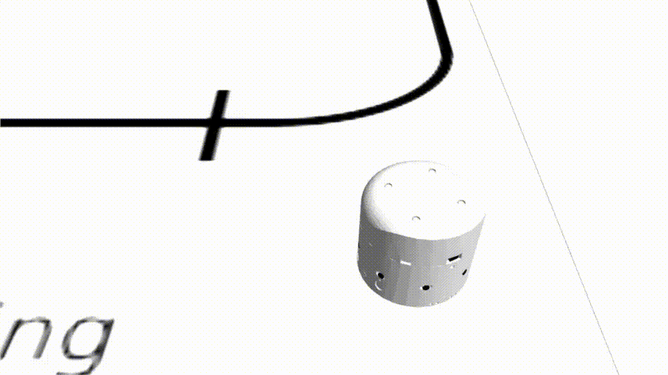

##  					Differential Wheeled Robot Simulator

I am building a DWheel drive robot. This is a gazebo-ros simulator for DWheel drive robot. Presently, I am experimenting with path planning and localization.

The package is designed by researchers at Uni Bielefeld, Germany and thanks to all researchers - I am using this simulator to test my robot and it is very helpful. The software works with ROS kinetic and Gazebo 7.8 on Ubuntu 16.04.

### PREREQUISITE

Assuming ROS Kinetic is already installed in your system - if not check https://github.com/vikiworks-io/ros_installer.
The software is tested in ROS Kinetic under Ubuntu 16.04.

### SETUP INSTRUCTION

Open two terminals and do the following steps as mentioned

#### Terminal 1: [ Compile, start gazebo with robot ]

    $cd ~ 
    $git clone https://github.com/vikiworks-io/D_Wheel_Robot_Simulator.git
    $cd D_Wheel_Robot_Simulator
    $rm -rf devel build
    $catkin_make
    $source devel/setup.bash
    $export GAZEBO_MODEL_PATH=./src/amiro_robot/amiro_gazebo/models
    $roslaunch amiro_gazebo amiro_assembly_line.launch 

#### Terminal 2: [ Control virtual robot using python script ]

    $cd ~ 
    $cd D_Wheel_Robot_Simulator
    $source devel/setup.bash
    $export GAZEBO_MODEL_PATH=./src/amiro_robot/amiro_gazebo/models
    $cd robot_controller
    $python drive_robot.py

##### Reference:
	
    https://github.com/tik0/amiro_robot
